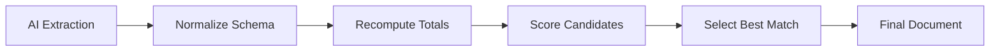

## Overview

Reconciliation is the process of ensuring that extracted invoice data adds up correctly. The Invoice OCR system performs sophisticated mathematical validation to detect and correct extraction errors, producing totals that match the printed invoice.

## Why Reconciliation Matters

AI models can extract text and numbers from invoices, but they don't inherently understand invoice arithmetic:

<CardGroup cols={3}>
  <Card title="Discount Logic" icon="percent">
    Sequential vs flat, before vs after tax
  </Card>
  <Card title="Tax Calculation" icon="calculator">
    CGST/SGST splits, rate slabs, rounding
  </Card>
  <Card title="Header vs Line" icon="list">
    Invoice-level vs item-level discounts
  </Card>
</CardGroup>

Without reconciliation, you might get:
- Grand totals that don't match the printed amount
- Tax calculations that are off by several rupees
- Discounts applied in the wrong order

## Reconciliation Architecture

The system uses a two-phase approach:



### Phase 1: Extraction

```typescript
// Source: app/api/ocr-structured-v4/route.ts:136-194
const SYSTEM_PROMPT = `# Role
You are an invoice OCR normalizer for India GST (v4)...

# Decision Rules
1. Price Mode
   - Prefer ex‑tax lines when a separate GST summary exists
2. Discounts
   - Apply sequentially: d_eq = d1 + d2 − d1*d2
3. Line Math (normalized to ex‑tax)
   - WITH_TAX → base_ex = rate_printed / (1 + t)
   - WITHOUT_TAX → base_ex = rate_printed
...
`;
```

The AI model extracts data following strict rules, but may still have ambiguities or errors.

### Phase 2: Reconciliation

```typescript
// Source: lib/invoice_v4.ts:587-641
export function reconcileV4(input: V4Doc): V4Doc {
  // Try multiple hypotheses and score by:
  // 1. Error vs printed grand total
  // 2. Implied round‑off reasonableness
  const candidates: Candidate[] = [
    { name: "as_is", doc: recomputeDoc(input, ...), ... },
    { name: "from_printed_with_tax", doc: rerateFromPrinted(input, "WITH_TAX", ...), ... },
    { name: "from_printed_without_tax", doc: rerateFromPrinted(input, "WITHOUT_TAX", ...), ... },
  ];
  
  // Pick best by lowest score (error + round_off penalty)
  let best = candidates[0];
  ...
  return out;
}
```

## Line-Level Reconciliation

Each invoice line item goes through multi-step reconciliation:

<Steps>
  <Step title="Choose Best Ex-Tax Value">
    The system evaluates three sources:
    
    ```typescript
    // Source: lib/invoice_v4.ts:160-206
    // Candidate 1: compute from rate/discounts
    const computedLineEx = afterFlat * qty;
    
    // Candidate 2: trust printed amount if price mode suggests ex‑tax
    const printedLineEx = priceMode === "WITHOUT_TAX" ? printedAmt : ...
    
    // Candidate 3: model-provided explicit ex-tax after discount
    const modelLineEx = n(it.raw?.amount_ex_tax_after_discount);
    ```
    
    <Note>
      The system prefers printed amounts when available, but falls back to computed values if discounts indicate the printed amount is pre-discount.
    </Note>
  </Step>
  
  <Step title="Normalize GST Rate">
    Snap noisy model outputs to real GST slabs:
    
    ```typescript
    // Source: lib/standards.ts:15-38
    export const GST_SLABS = [0, 0.25, 3, 5, 12, 18, 28] as const;
    
    export function normalizeGstRate(input: unknown): number {
      // If model returns 0.18 for 18%, scale to percent
      if (rate > 0 && rate <= 1.5) rate = rate * 100;
      
      // Snap to nearest known slab within tolerance
      const nearest = GST_SLABS.reduce((prev, s) =>
        Math.abs(rate - s) < Math.abs(rate - prev) ? s : prev
      );
      if (Math.abs(rate - nearest) <= 0.75) return nearest;
      ...
    }
    ```
  </Step>
  
  <Step title="Calculate Tax Split">
    Determine CGST/SGST vs IGST based on state codes:
    
    ```typescript
    // Source: lib/invoice_v4.ts:140-147
    const supplierState = getStateCodeFromGstin(out.doc_level?.supplier_gstin);
    const posCode = parseInt(out.doc_level?.place_of_supply_state_code, 10);
    const isIntra = supplierState === posCode;
    
    // Source: lib/invoice_v4.ts:227-232
    gst: {
      rate: tRate,
      cgst: r2(tRate > 0 && isIntra === true ? (gstAmt / 2) : 0),
      sgst: r2(tRate > 0 && isIntra === true ? (gstAmt / 2) : 0),
      igst: r2(tRate > 0 && isIntra === false ? gstAmt : 0),
      amount: r2(gstAmt),
    }
    ```
    
    <Tip>
      Intra-state transactions split GST equally into CGST and SGST. Inter-state uses IGST only.
    </Tip>
  </Step>
</Steps>

## Header-Level Reconciliation

After line items are reconciled, the system applies header-level adjustments:

### Sequential Discounts

```typescript
// Source: lib/invoice_v4.ts:246-265
const ordered = [...(out.header_discounts || [])].sort((a, b) => n(a.order) - n(b.order));

const applyPercent = (pct: number) => {
  const f = 1 - pct / 100;
  for (const k of Object.keys(bucketEx)) bucketEx[k] = r2(bucketEx[k] * f);
  const cut = r2(baseEx * (pct / 100));
  baseEx = r2(baseEx - cut);
  headerDiscEx = r2(headerDiscEx + cut);
};

const applyAbsolute = (amt: number) => {
  const total = Object.values(bucketEx).reduce((s, v) => s + v, 0) || 1;
  for (const k of Object.keys(bucketEx)) {
    const share = bucketEx[k] / total;
    bucketEx[k] = r2(Math.max(0, bucketEx[k] - amt * share));
  }
  baseEx = r2(Math.max(0, baseEx - amt));
  headerDiscEx = r2(headerDiscEx + amt);
};

for (const hd of ordered) {
  const type = String(hd.type || "").toUpperCase();
  if (type === "PERCENT") applyPercent(n(hd.value));
  else if (type === "ABSOLUTE") applyAbsolute(Math.min(n(hd.value), baseEx));
}
```

**Key behaviors**:
- **Percent discounts**: Applied sequentially using `d_eq = d1 + d2 − d1*d2` formula
- **Absolute discounts**: Allocated proportionally across tax buckets
- **Order matters**: `order` field determines application sequence

### HSN Table Anchoring

When a printed HSN tax table exists, it becomes the source of truth:

```typescript
// Source: lib/invoice_v4.ts:334-383
const printedBucketByRate: Record<string, number> = {};
for (const row of printedTable) {
  let r = normalizeGstRate(n(row?.cgst_rate) + n(row?.sgst_rate) + n(row?.igst_rate));
  const ex = n(row?.taxable_value);
  if (ex > 0 && Number.isFinite(r) && r > 0) {
    const key = String(r);
    printedBucketByRate[key] = r2((printedBucketByRate[key] || 0) + ex);
  }
}

if (printedBucketTotal > 0) {
  // Scale items within each rate bucket to match printed taxable value exactly
  for (const [rateStr, target] of Object.entries(printedBucketByRate)) {
    const idxs = rateToIdx[rateStr] || [];
    const current = idxs.reduce((s, i) => s + n(out.items[i]?.totals?.line_ex_tax), 0);
    if (idxs.length === 0 || current <= 0) continue;
    const scale = target / current;
    for (const i of idxs) {
      // Scale each item proportionally
      ...
    }
  }
}
```

<Note>
  HSN tables are the most reliable anchor because they're typically printed by accounting software and represent validated totals per tax rate.
</Note>

## Charges and TCS

Additional charges and TCS are reconciled after items:

<Tabs>
  <Tab title="Taxable Charges">
    ```typescript
    // Source: lib/invoice_v4.ts:453-477
    out.charges = (out.charges || []).map((c) => {
      const ex = r2(n(c.ex_tax));
      const isTaxable = !!c.taxable;
      const rate = isTaxable ? 
        (c.gst_rate_hint != null ? n(c.gst_rate_hint) : weightedRate) : 
        0;
      const gst = r2(ex * (rate / 100));
      if (isTaxable) {
        chargesEx += ex;
        const key = String(r2(rate));
        if (rate > 0) {
          bucketEx[key] = (bucketEx[key] || 0) + ex;
        }
      }
      return { ...c, gst_rate_hint: c.gst_rate_hint, gst_amount: gst, inc_tax: r2(ex + gst) };
    });
    ```
    
    **GST rate inference**: If a charge is marked taxable but no rate is provided, the system uses the weighted average GST rate from items.
  </Tab>
  
  <Tab title="Non-Taxable Charges">
    ```typescript
    // Source: lib/invoice_v4.ts:485-520
    const decideIncludeNonTaxable = (): boolean => {
      const mode = opts.nonTaxableChargesMode || "auto";
      if (mode === "include") return true;
      if (mode === "exclude") return false;
      // auto: choose the option that minimizes error vs printed grand total
      ...
      return err_excl < err_incl ? false : true;
    };
    ```
    
    **Auto-detection**: The system tries both including and excluding non-taxable charges in totals, then picks the option that best matches the printed grand total.
  </Tab>
  
  <Tab title="TCS (Tax Collected at Source)">
    ```typescript
    // Source: lib/invoice_v4.ts:536-541
    let tcsAmount = n(out.tcs?.amount);
    if (n(out.tcs?.rate) > 0 && tcsAmount === 0) {
      tcsAmount = r2(grandBeforeTcs * (n(out.tcs.rate) / 100));
    }
    const grandAfterTcs = r2(grandBeforeTcs + tcsAmount);
    ```
    
    TCS is applied **after** GST calculation on the subtotal including tax.
  </Tab>
</Tabs>

## Candidate Scoring

The reconciliation engine evaluates multiple hypotheses:

```typescript
// Source: lib/invoice_v4.ts:587-622
const candidates: Candidate[] = [
  { name: "as_is", doc: recomputeDoc(input, { preferItemsOnlyWhenNoHSN: false }), ... },
  { name: "as_is_items_only_when_no_hsn", doc: recomputeDoc(input, { preferItemsOnlyWhenNoHSN: true }), ... },
  { name: "from_printed_with_tax", doc: rerateFromPrinted(input, "WITH_TAX", ...), ... },
  { name: "from_printed_without_tax", doc: rerateFromPrinted(input, "WITHOUT_TAX", ...), ... },
];

const scoreOf = (c: Candidate) => {
  const computedNoRound = r2((n(d.totals?.grand_total) - n(d.round_off)));
  const impliedRound = printedGrand > 0 ? r2(printedGrand - computedNoRound) : n(d.round_off);
  const err = c.errorAbs;
  const roundPenalty = Math.max(0, Math.abs(impliedRound) - 1); // prefer |round_off| <= 1
  const score = r2(err + roundPenalty);
  return { score, impliedRound };
};

// Pick best by lowest score
let best = candidates[0];
let bestMeta = scoreOf(best);
for (const c of candidates.slice(1)) {
  const meta = scoreOf(c);
  if (meta.score < bestMeta.score || ...) {
    best = c;
    bestMeta = meta;
  }
}
```

**Scoring criteria**:
1. **Error vs printed grand total**: Lower is better
2. **Implied round-off**: Should be ≤ ₹1.00 for reasonable invoices
3. **Tie-breaking**: Prefer lower absolute round-off, then lower error

<Warning>
  A large round-off (> ₹1.00) often indicates incorrect discount logic or tax calculation mode. The system penalizes such candidates.
</Warning>

## Reading Reconciliation Output

### Reconciliation Object

```json
{
  "reconciliation": {
    "error_absolute": 0.10,
    "alternates_considered": [
      "as_is:err=0.10,implied_round=0.10,score=0.10",
      "from_printed_with_tax:err=2.50,implied_round=2.50,score=3.50",
      "from_printed_without_tax:err=15.30,implied_round=15.30,score=29.30"
    ],
    "warnings": [
      "Excluded non-taxable charges (₹50.00) from totals to match printed amount."
    ]
  }
}
```

**Fields explained**:

| Field | Description | Ideal Value |
|-------|-------------|-------------|
| `error_absolute` | Difference between computed and printed grand total | ≤ 0.05 (5 paise) |
| `alternates_considered` | List of hypotheses tried with their scores | Multiple options logged |
| `warnings` | Non-critical adjustments made during reconciliation | Empty or minimal |

### Totals Object

```json
{
  "totals": {
    "items_ex_tax": 1000.00,
    "header_discounts_ex_tax": 50.00,
    "charges_ex_tax": 100.00,
    "taxable_ex_tax": 1050.00,
    "gst_total": 189.00,
    "grand_total": 1239.10
  }
}
```

**Calculation flow**:

<Steps>
  <Step title="Items ex-tax">
    Sum of all line items after item-level discounts: `₹1000.00`
  </Step>
  
  <Step title="Header discounts">
    Invoice-level discounts applied: `-₹50.00`
  </Step>
  
  <Step title="Charges">
    Additional charges (freight, etc.): `+₹100.00`
  </Step>
  
  <Step title="Taxable subtotal">
    Base for GST calculation: `₹1050.00`
  </Step>
  
  <Step title="GST total">
    Tax calculated on taxable subtotal: `+₹189.00`
  </Step>
  
  <Step title="Grand total">
    Final amount including round-off: `₹1239.10`
  </Step>
</Steps>

## Debugging Reconciliation

Use the Review Tool to inspect reconciliation in detail:

### Compact Schema Breakdown

```typescript
// Source: app/review/page.tsx:179-339
function CompactBreakdown({ doc }: { doc: InvoiceDoc }) {
  const reconciliation = React.useMemo(() => reconcile(doc), [doc]);
  const { lines, charges, items_taxable_total, items_tax_total, 
          difference } = reconciliation;
  
  return (
    <div className="space-y-4">
      <Card>
        <CardHeader>
          <CardTitle>Line-Level Math</CardTitle>
          <CardDescription>
            Qty × rate, item discounts, invoice-level discounts, and tax per line.
          </CardDescription>
        </CardHeader>
        ...
      </Card>
    </div>
  );
}
```

**What you'll see**:
- Per-line calculations with intermediate values
- Discount allocations (item-level vs invoice-level)
- Tax calculation breakdown by rate
- Final difference vs printed total

<Tip>
  The Review Tool at `/review` accepts JSON from LangFuse traces or API responses. Paste the full payload to see detailed reconciliation breakdowns.
</Tip>

## Common Reconciliation Scenarios

### Scenario 1: With-Tax vs Without-Tax

**Problem**: Model extracts rates but doesn't know if they include GST.

**Solution**: Reconciliation tries both interpretations:

```typescript
function rerateFromPrinted(doc: V4Doc, mode: "WITH_TAX" | "WITHOUT_TAX", ...): V4Doc {
  const out = clone(doc);
  out.items = (out.items || []).map((it) => {
    const t = n(it.gst?.rate) / 100;
    const printedRate = n(it.raw?.rate_printed) || n(it.rate_ex_tax);
    const baseEx = mode === "WITH_TAX" ? (printedRate / (1 + t)) : printedRate;
    return { ...it, rate_ex_tax: r2(baseEx) };
  });
  return recomputeDoc(out, opts);
}
```

The candidate with the lowest error is selected.

### Scenario 2: Missing HSN Table

**Problem**: No HSN table printed; only a single taxable subtotal.

**Solution**: System infers whether charges are included:

```typescript
// Source: lib/invoice_v4.ts:419-448
const printedTaxable = n(out.printed?.taxable_subtotal);
if (printedTaxable > 0) {
  const draftChargesTaxable = (out.charges || []).reduce(...);
  const targetItemsOnly = r2(Math.max(0, printedTaxable - draftChargesTaxable));
  const preferItemsOnly = (draftChargesTaxable > 0);
  const chosenTarget = preferItemsOnly ? targetItemsOnly : printedTaxable;
  const cut = r2(baseEx - chosenTarget);
  if (cut > 0.75) {
    // Allocate reduction guided by target items GST
    allocateAbsoluteSmart(cut, targetItemsGst);
  }
}
```

### Scenario 3: Large Round-Off

**Problem**: Computed total differs from printed by several rupees.

**Solution**: Review warnings for clues:

```json
{
  "reconciliation": {
    "error_absolute": 5.50,
    "warnings": [
      "Excluded non-taxable charges (₹5.50) from totals to match printed amount."
    ]
  }
}
```

Non-taxable charges might not be included in the printed grand total.

## Next Steps

<CardGroup cols={2}>
  <Card title="Debugging with Review Tool" icon="bug" href="/guides/debugging-with-review-tool">
    Use the /review page to debug reconciliation issues
  </Card>
  <Card title="API Reference" icon="code" href="#">
    Explore the full reconciliation API schema
  </Card>
</CardGroup>
